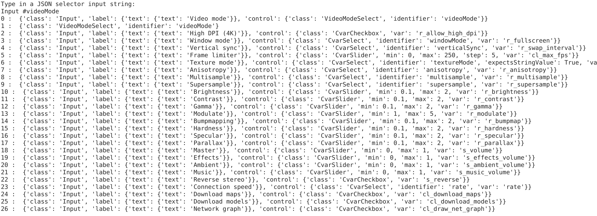
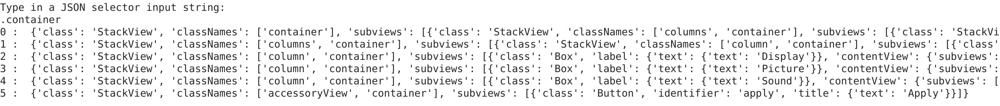
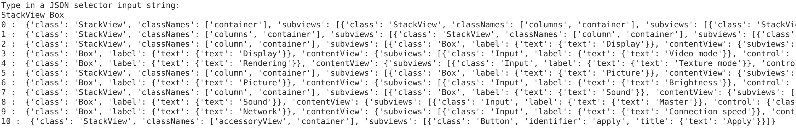
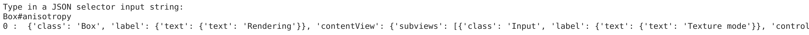
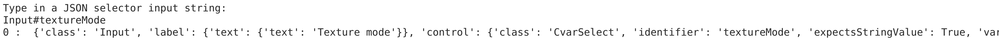
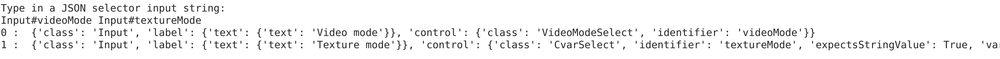

# JSONSelector
JSONSelector script

This is a script that selects sections of JSON data based on an input string specifying specific JSON attributes that one wants to retrieve.

To run this script, you would run:
```
    python main.py
```

An input prompt will ask you to input a string for the JSON parser to use to search for sections of a JSON file.

This script is capable of single selectors

<br/><br/>


It is also capable of compound selectors

<br/><br/>


And selector chains

<br/><br/>


This can even handle compound selector chains (though this part may be buggy):



